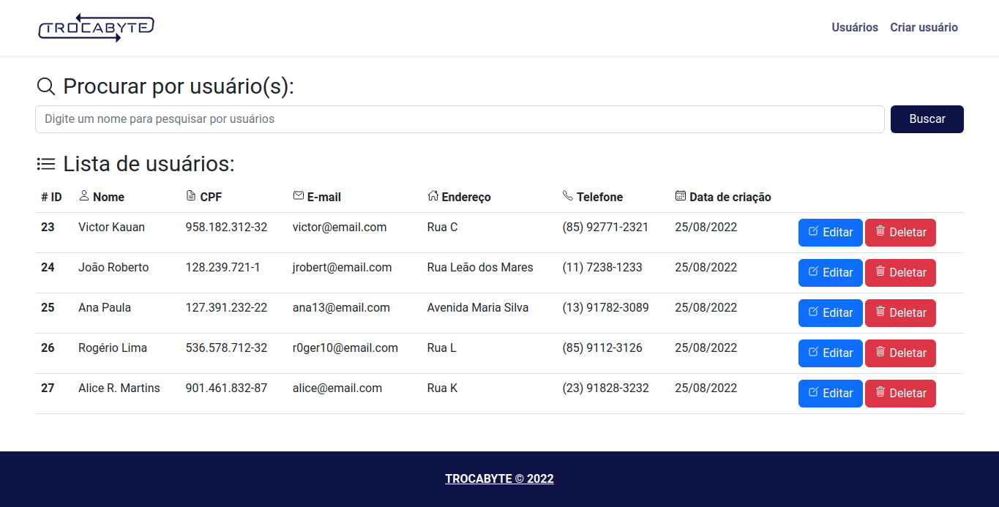
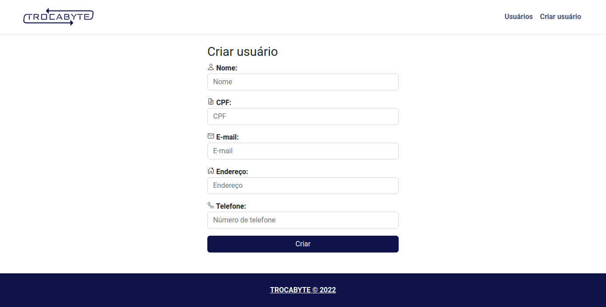
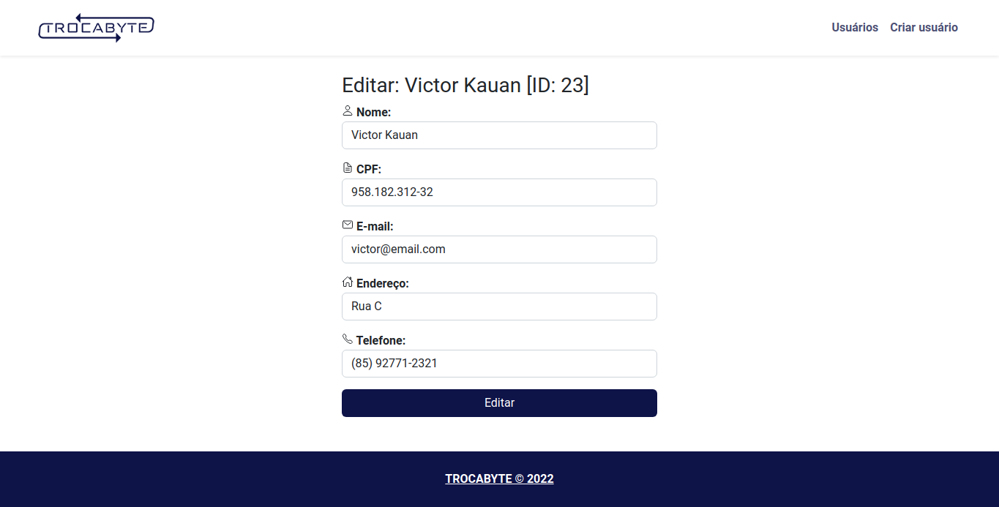

    

## TROCABYTE CRUD

- [Screens](#screens)
    - [Homepage](#homepage)
    - [User creation page](#user-creation-page)
    - [User edition page](#user-edition-page)
- [Technologies](#technologies)
- [License](#license)

## Screens

#### Homepage

#### User creation page

#### User edition page

## Technologies

- **[PHP](https://www.php.net/docs.php)**
- **[Laravel](https://laravel.com/docs/9.x)**
- **[Blade](https://laravel.com/docs/9.x/blade)**
- **[Eloquent](https://laravel.com/docs/9.x/eloquent)**
- **[Iconicons](https://ionic.io/ionicons)**
- **[jQuery](https://api.jquery.com/)**
## License

The Laravel framework is open-sourced software licensed under the [MIT license](https://opensource.org/licenses/MIT).
